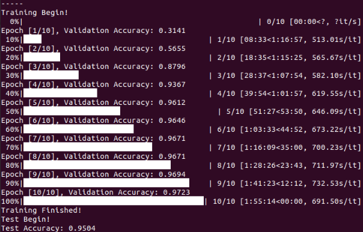
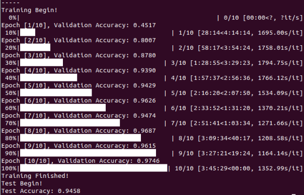
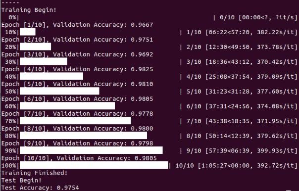

# Sample-Traffic-Sign-Detection
Simple traffic sign recognition, the traffic sign has been taken down, we do not need to search, we just need to use some simple network for tests

## Dataset

download at: https://s3-us-west-1.amazonaws.com/udacity-selfdrivingcar/traffic-signs-data.zip

## Environment

pytorch

## Run

```
python train.py
```

use other network by --model
```
python train.py --model xxx
```

## Results

- LeNet  


- AlexNet  


- VGG11  


- ResNet  

